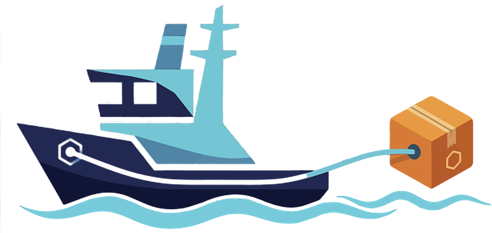

# 

## Tugboat: Multi-Format Artifact Gateway

**Tugboat** is a cloud-native, blazing-fast artifact gateway designed to bridge the gap between traditional package managers (like Maven and npm) and modern OCI-compliant registries (like Harbor). 

Born out of the need for a modern, scalable alternative to legacy repository managers, Tugboat acts as a smart proxy. It allows developers to use their familiar build tools while storing all artifacts seamlessly as OCI artifacts in Harbor using the ORAS (OCI Registry As Storage) standard.

---

### 🚀 Key Features

* **OCI-Native Storage:** Eliminates the need for specialized blob storage or databases. All packages are translated and stored as standard OCI artifacts in Harbor.
* **Kubernetes-First:** Completely stateless and designed exclusively to run in Kubernetes. Scales horizontally with ease.
* **Cloud-Native Performance:** Powered by **Quarkus** ("Kubernetes Native Java") and Eclipse Vert.x for ultra-low memory footprint and highly efficient, non-blocking I/O streaming of large artifacts.
* **Built on Standards:** Utilizes the official **ORAS Java SDK** for robust and compliant communication with OCI registries.
* **Drop-in Replacement:** Developers don't need to change their workflows. Simply point your `settings.xml` or `.npmrc` to Tugboat, and it handles the rest.

---

### 🏗️ Architecture

1. **Client Request:** A developer or CI/CD pipeline requests a package (e.g., a Maven `.jar`) from Tugboat using standard HTTP.
2. **Translation:** Tugboat intercepts the request and dynamically translates the legacy coordinates (GroupId, ArtifactId, Version) into an OCI reference.
3. **OCI Proxy (ORAS):** Tugboat uses the ORAS Java SDK to fetch or push the corresponding artifact layers from/to the backend Harbor registry.
4. **Streaming Delivery:** The artifact is streamed reactively back to the client without ever buffering the full file in memory.

---

### 🛠️ Tech Stack

* **Language:** Java
* **Framework:** Quarkus (Reactive / Vert.x)
* **OCI Integration:** ORAS Java SDK (`oras-java`)
* **Backend Registry:** Harbor (or any OCI-compliant registry)
* **Deployment:** Kubernetes

---

### 📦 Getting Started (Kubernetes)

Tugboat is designed to be deployed exclusively on Kubernetes. 

*(Helm charts and deployment manifests will be added to the `/deploy` directory shortly).*

**Basic Environment Variables:**
```yaml
env:
  - name: TUGBOAT_REGISTRY_URL
    value: "https://harbor.yourdomain.com"
  - name: TUGBOAT_REGISTRY_PROJECT
    value: "maven-artifacts"
  - name: QUARKUS_HTTP_PORT
    value: "8080"
```

---

### 👨‍💻 Local Development

To run Tugboat locally in development mode, you will need Java 17+ and Maven installed.

1. Clone the repository:
   ```bash
   git clone https://github.com/your-org/tugboat.git
   cd tugboat
   ```
2. Start Quarkus in dev mode (includes live coding):
   ```bash
   ./mvnw compile quarkus:dev
   ```
3. The gateway will be available at `http://localhost:8080`.

*(Note: You will need a Harbor instance or local OCI registry like distribution/distribution running to test the ORAS integration).*

---

### 📄 License

This project is licensed under the **Apache License 2.0**. See the [LICENSE](LICENSE) file for details.

By using the Apache 2.0 license, Tugboat ensures enterprise-friendly adoption, providing patent protection and the freedom to extend the gateway for your own internal infrastructure.
